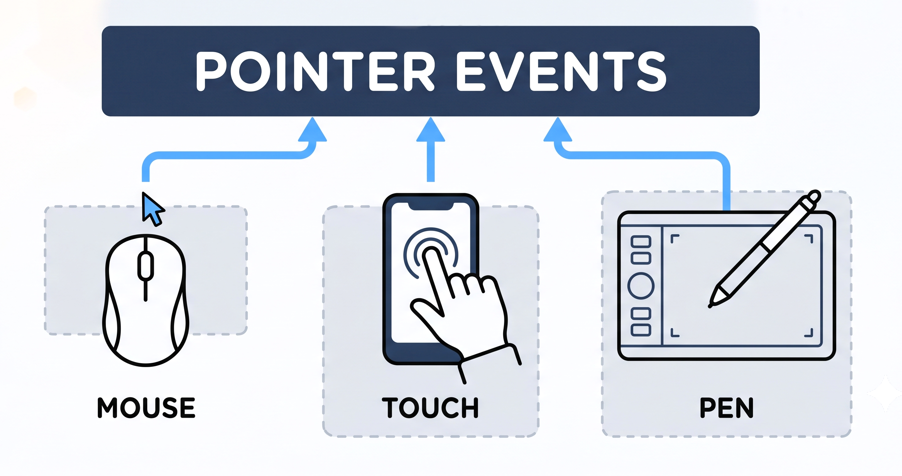

🖱️ How pointerEvents unified input handling

The 3D interface had weirdly complex input detection code. Some extra complexity was needed but couldn't figure out why.

Turns out: touch devices fire both `touchstart`/`touchend` AND synthetic `mousedown`/`mouseup` for compatibility. That's 4 events, each with different coordinates, duplicate filtering, edge cases...

Then discovered `pointerEvents`, which unifies clicks, touches, and stylus input into a single `pointerdown` event.

