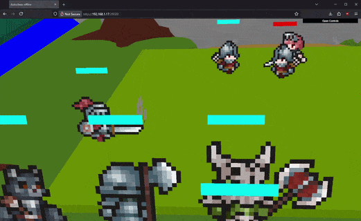

📷 Free camera override for 3D debugging

Added `cameraOverride` to Display - position (x, y, z) and rotation (x, y) that stacks with the base camera.

In offline mode, dat.gui controls let you tweak camera in real-time. Perfect for debugging board layouts, checking collision zones, or just admiring your scene from new angles.

