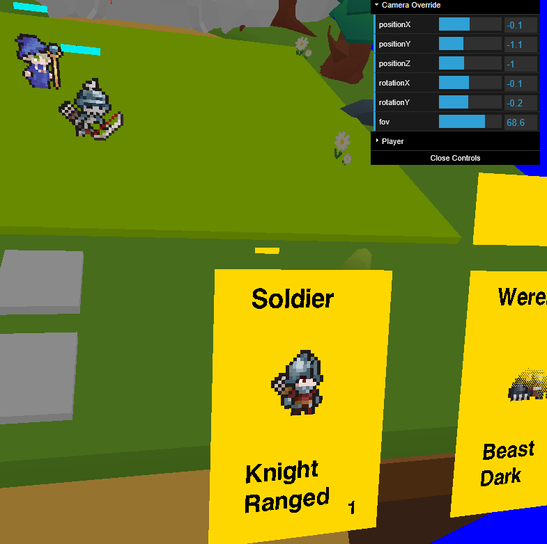

📷 Zoom control for development and screenshots

The camera zoom is now adjustable during development in offline mode. This helps when debugging different board layouts and piece behavior without needing to restart. It also makes it easy to capture screenshots at the perfect angle for blog posts and documentation—zoom out to show the full battlefield, or zoom in to highlight specific interactions like piece combat or ability effects.

