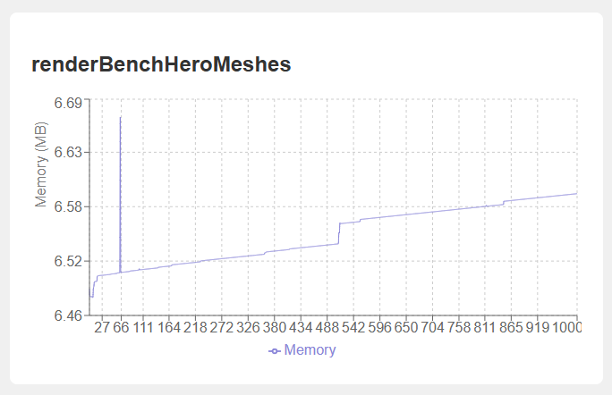

# 🔍 Detecting memory leaks

A memory leak happens when your game uses more RAM each time an action repeats. We built a benchmark to catch this automatically. It runs display functions 100 times and tracks RAM usage. A consistently climbing RAM indicates a leak. Stable RAM indicates the code is safe.

