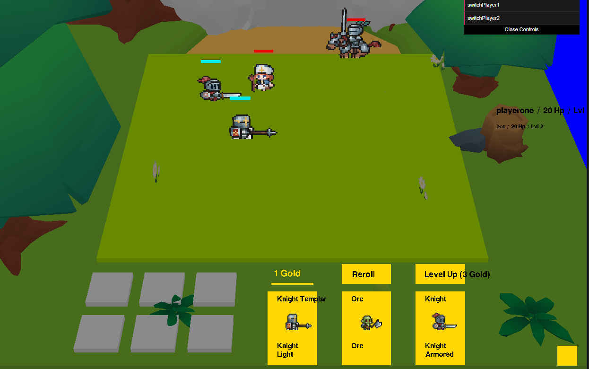

🎮 Announcing Autochess

An experimental open-source project exploring 3D game development with Three.js. A real-time multiplayer strategy experience built from scratch.

This dev blog documents progress, technical decisions, and how the project evolves.

https://github.com/ferdodo/autochess

