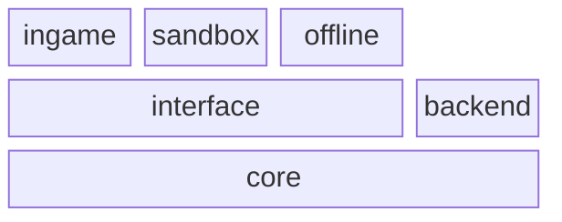

# Core

Core is a library that contains the entire logic and modelisation of the game.

## Directory structure

* **Api:** Frontend bindings, and backend handlers for all API calls.
* **Automations:** Function that simulate a user action for testing purpose.
* **Benchmark:** Benchmarking utilities running in Node.js.
* **Fixtures:** Functions that create a starting point for testing purpose.
* **Mocks:** Mocking utilities.
* **Types:** Contain both typescript interfaces, and json-schema.
* **Utils:** Just a bunch of functions, usable anywhere.
* **Workflows:** Backend operations that will be triggered by specific events.
