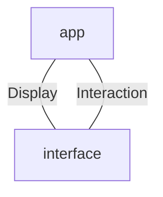

# Interface

Interface is a library for rendering the 3d view.

It takes as input the **Display** data structure that contains all displayable informations to be rendered at screen, and provide the **Interaction** data structure, which transmits what action the current player is emiting by interacting with the 3d view.

