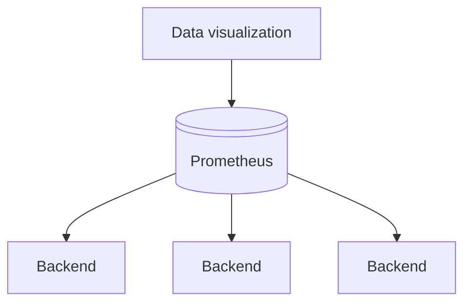

# Prometheus

Prometheus stores backend metrics.

You need to setup data visualization yourself. Grafana is recommended to easily setup Prometheus as data source and start creating your own dashboards.

