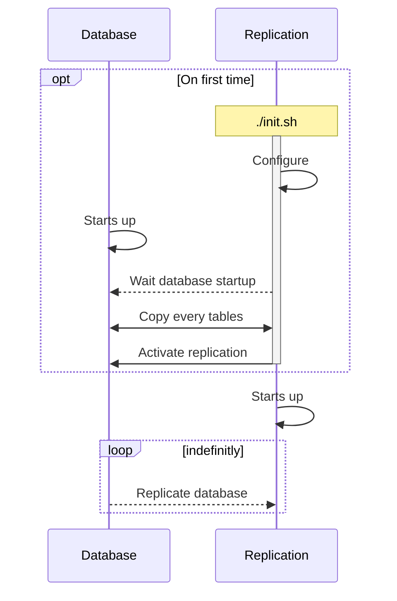

# Replication

Live backup for the database. The replication service to be prefered for running diagnostic and analysis SQL queries. Run sql queries with:

```
$ docker compose exec replication psql -U user -d autochess
```

## Startup description


